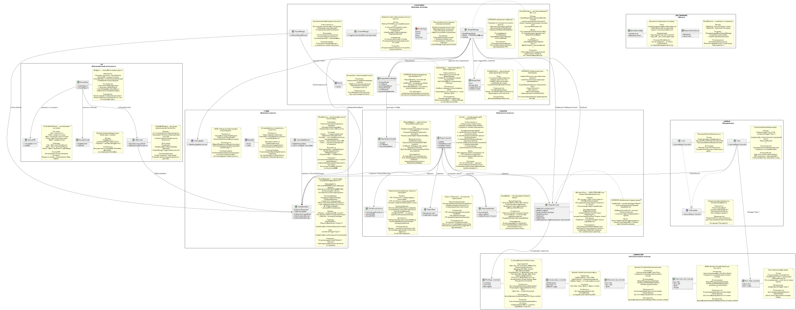

# House of Echoes — Архитектура проекта

Данный документ описывает архитектурную структуру игры **House of Echoes** — трёхмерного хоррора с полулинейным сюжетом, кат-сценами и поддержкой многопользовательского режима. Архитектура построена на принципах модульности, слабой связанности, чёткого разделения ответственности и расширяемости.

---

## Содержание

- [Архитектура проекта](#архитектура-проекта)
- [Основные принципы](#основные-принципы)
- [Ядро (Core)](#ядро-core)
- [Подсистема игрока (Player)](#подсистема-игрока-player)
- [Анимационная система](#анимационная-система)
- [Искусственный интеллект (AI)](#искусственный-интеллект-ai)
- [Окружение (World)](#окружение-world)
- [Игровые системы (Features)](#игровые-системы-features)
- [Сетевая подсистема](#сетевая-подсистема)
- [Структура проекта](#структура-проекта)

---

## Архитектура проекта

Ниже — полная модульная схема игры **House of Echoes**, отражающая все системы: игрок, оружие, ИИ, события, сеть и окружение.



---

## Основные принципы

- **Единая ответственность**: каждый класс решает ровно одну задачу.
- **Слабая связанность**: модули взаимодействуют через события или интерфейсы, а не напрямую.
- **Композиция вместо наследования**: поведение собирается из независимых компонентов.
- **Независимость от сети**: игровая логика одинакова в одиночной и сетевой игре.
- **Тестируемость**: физика, ИИ и машины состояний могут тестироваться вне Unity.
- **Безопасность контекста**: действия (выстрел, перезарядка, движение) разрешены только в допустимых глобальных состояниях (например, `Explore`).

---

## Ядро (Core)

### Машина состояний игры (`GameStateMachine`)

Центральный регулятор контекста игры. Управляет глобальными режимами:

- **Explore** — стандартный геймплей (движение, взаимодействие).
- **Cinematic** — кат-сцены (ввод отключён, камера управляема).
- **Combat** — повышенная активность ИИ.
- **Pause** — пауза (UI активен, физика остановлена).

Предотвращает конфликты (например, стрельбу во время кат-сцены). Все игровые системы проверяют текущее состояние перед выполнением действий. Реализует паттерн *Game State Machine*, широко используемый в AAA-играх.

### Глобальная шина событий (`GlobalEventBus`)

Статический агрегатор событий, реализующий паттерны *Mediator* и *Observer*.

- События — **сигналы**, а не команды.
- Передаются только примитивы (ID, тип, булевы значения).
- Логические каналы: `Gameplay`, `World`, `AI`.

Пример:
```csharp
if (Input.GetButtonDown("Interact"))
    GlobalEventBus.OnInteractRequested?.Invoke();
```

Обеспечивает слабую связанность между системами: игрок, двери, UI, звук и ИИ не ссылаются друг на друга напрямую.

> **Новые события**:  
> - `OnWeaponFired(string weaponName)` — сигнал о выстреле  
> - `OnWeaponReloadStarted` — начало перезарядки  
> - `OnGameStateChanged(GameState new, GameState old)` — смена контекста

### Система сохранения (`ISaveable`)

Интерфейс для всех сущностей, поддерживающих сохранение:

```csharp
public interface ISaveable
{
    void Save();
    void Load();
}
```

Реализуется `Player`, `GameState`, `Inventory`. Позволяет единообразно обрабатывать сохранение без знания конкретного типа объекта (принцип *Dependency Inversion*).

### Получение урона (`IDamageable`)

Универсальный контракт для любых объектов, способных получать урон:

```csharp
public interface IDamageable
{
    void TakeDamage(float amount);
}
```

Реализуется врагами, игроком, разрушаемыми объектами (бочки, ящики). Позволяет системе оружия наносить урон **полиморфно**, без знания конкретного типа цели.

---

## Подсистема игрока (Player)

### Контроллер игрока (`PlayerController`)

Выступает в роли **фасада** — координирует подсистемы, но не содержит игровой логики.

В методе `Update()`:
1. Получает данные от `PlayerInputHandler`.
2. Передаёт вектор движения в `PlayerMotor`.
3. Обновляет параметры анимации через `PlayerAnimator`.
4. Управляет режимом камеры через `ThirdPersonCamera`.
5. Проверяет возможность взаимодействия и **управления оружием**.

Перед вызовом `Shoot()` или `Reload()` проверяет, что текущее состояние — `Explore`. Не содержит проверок здоровья, боезапаса или сетевой логики.

### Обработчик ввода (`PlayerInputHandler`)

Адаптер над Unity Input System. Возвращает нормализованный вектор движения и состояние прицеливания. Поддерживает действия:
- `IsShooting()` — левая кнопка мыши
- `IsReloading()` — клавиша R

Активен только у локального игрока в сетевой игре.

### Двигатель перемещения (`PlayerMotor`)

Чистая логика перемещения через `CharacterController.SimpleMove()`. Учитывает наклон поверхности и ограничивает скорость на склонах. Не знает об анимациях, камере или здоровье.

### Система камеры (`ThirdPersonCamera`)

Управляет тремя режимами с плавными переходами:
- **TPS** — вид от третьего лица.
- **FPS** — прицеливание.
- **Cinematic** — управляемая камера в кат-сценах.

Использует `SmoothDamp` и ограничивает углы обзора, чтобы избежать бесконечного вращения.

### Прокси аниматора (`PlayerAnimator`)

Единственная точка входа в анимационную систему. Все вызовы к `Animator` проходят через этот класс. Гарантирует отсутствие конфликтов параметров и соблюдение закона Деметры.

**Методы**:
- `SetMoveDirection(Vector2)`
- `SetIsAiming(bool)`
- `PlayShoot()`
- `PlayReload()` ← новое
- `SetWeaponOverride(AnimatorOverrideController)` ← новое

### Сетевой адаптер (`PlayerNetworkHandler`)

Единственный `NetworkBehaviour` на префабе игрока. Изолирует Mirror от основной логики:
- Обрабатывает ввод только у локального игрока.
- Валидирует действия на сервере через `[Command]`.
- Синхронизирует эффекты через `[ClientRpc]`.

---

## Анимационная система

Игрок использует многослойный `Animator Controller`:

- **Base Layer**: Locomotion (Idle, Walk Forward/Backward, Strafe).
- **UpperBody Layer**: Прицеливание, стрельба и **перезарядка** (только верх тела).
- **FX Layer**: Эмоции и реакции на урон (полное тело).

Все переходы прерываемые (`Has Exit Time = false`). Для каждого оружия создаётся **Animator Override Controller** (например, `Pistol_Override.controller`), который переопределяет только нужные анимации (`Aim_Idle`, `Shoot`, `Reload`), не дублируя всю логику контроллера.

---

## Искусственный интеллект (AI)

### Машина состояний врага (`EnemyFSM`)

Реализует паттерн *State Machine* с состояниями:
- `Idle` → `Patrol` → `Alert` → `Chase` → `Attack`.

Переходы управляются событиями восприятия (`OnSeePlayer`, `OnHearNoise`). Каждое состояние — отдельный класс (*State Pattern*).

### Агент ИИ (`EnemyBase`)

Полный ИИ-агент одного врага. Инкапсулирует:
- Систему восприятия (зрение, слух).
- FSM.
- Аниматор.
- Систему здоровья (**реализует `IDamageable`**).

Может существовать сотнями независимо.

### Режиссёр ИИ (`AIDirector`)

Глобальный регулятор напряжения, вдохновлённый *Resident Evil*. Отслеживает количество угроз, управляет спавном и влияет на эмоции игрока через `EmotionManager`.

---

## Окружение (World)

Все интерактивные объекты реализуют интерфейс:

```csharp
public interface IInteractable
{
    void Interact(PlayerController player);
}
```

Примеры:
- **Door**: проверяет наличие ключа, открывается, публикует событие `OnDoorOpened`.
- **Lever**: переключает состояние, уведомляет `PuzzleManager`.

`PlayerController` вызывает `.Interact(this)` полиморфно, не зная конкретный тип объекта.

---

## Игровые системы (Features)

### Система оружия

Разделена на два слоя:
- **`WeaponManager`**: чистая игровая логика — экипировка, выстрел, **перезарядка**.
- **`WeaponNetworkAdapter`**: сетевой слой — валидация, синхронизация.

**Особенности**:
- Выстрел и перезарядка **запрещены** вне состояния `Explore`.
- Оружие определяется через `ScriptableObject` (`WeaponData`), включающий:
  - `damage`, `fireRate`
  - `magazineSize`, `reloadTime` ← новые поля
  - `modelPrefab`, `overrideController`
- При экипировке вызывается `PlayerAnimator.SetWeaponOverride()`.
- Урон наносится через `Raycast` → `IDamageable.TakeDamage()`.

**Сетевая агностика**: логика идентична в одиночной и сетевой игре. Сеть подключается как адаптер.

### Система эмоций

Добавляет «живость» персонажу в моменты простоя:
- Срабатывает только в состоянии Idle.
- Отключается в режимах Cinematic и Combat.
- Реагирует на события мира (например, появление монстра → испуг).

### Система головоломок

Централизована в `PuzzleManager`. Все головоломки реализуют `IPuzzle`. Успешное решение публикует событие `OnPuzzleSolved`, которое могут перехватывать двери, триггеры и сюжетные системы.

---

## Сетевая подсистема

### Сессия игры (`NetworkGameSession`)

Точка входа в сетевую игру. Запускает хост или клиент, инициализирует Mirror и спавнит игрока.

### Состояние матча (`SyncedGameState`)

Хранит данные сессии на сервере:
- `matchId`
- `isMatchActive`
- список игроков

Синхронизируется через `SyncVar` и RPC. Является чистым DTO, не наследует `MonoBehaviour`.

---

## Структура проекта

```
Assets/
├── Core/
│   ├── Interfaces/
│   │   ├── ISaveable.cs
│   │   └── IDamageable.cs        ← новый файл
├── Player/
├── Animation/
│   └── Controllers/
│       └── Weapons/
│           ├── Pistol_Override.controller  ← новый
│           └── Rifle_Override.controller
├── AI/
├── World/
├── Features/
│   └── Weapon/
│       ├── WeaponManager.cs
│       └── WeaponNetworkAdapter.cs
├── Data/
│   └── Weapons/
│       └── Pistol.asset          ← пример данных
└── Networking/
```

Каждая папка содержит соответствующие скрипты, ассеты и (опционально) `.asmdef` файлы для управления зависимостями.

